# TASK1

### 1.结果可视化

这里的N-gram，n=2； n=3 OOM了

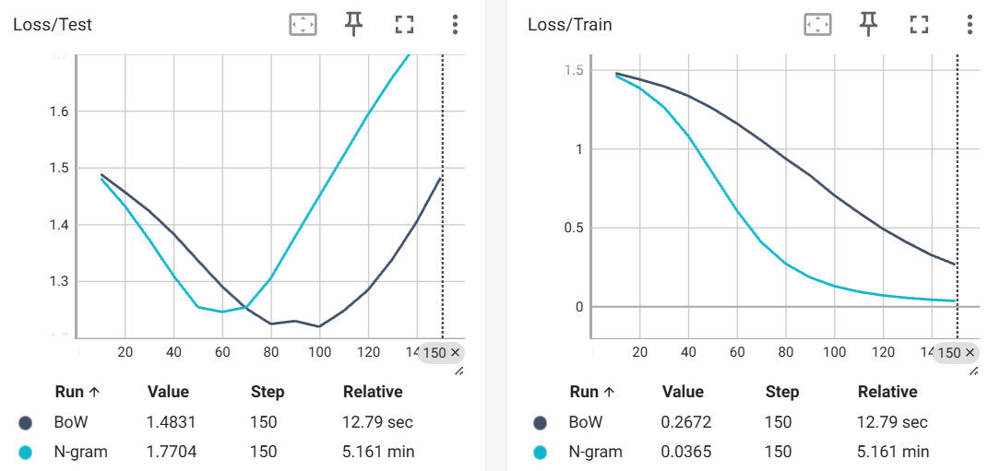

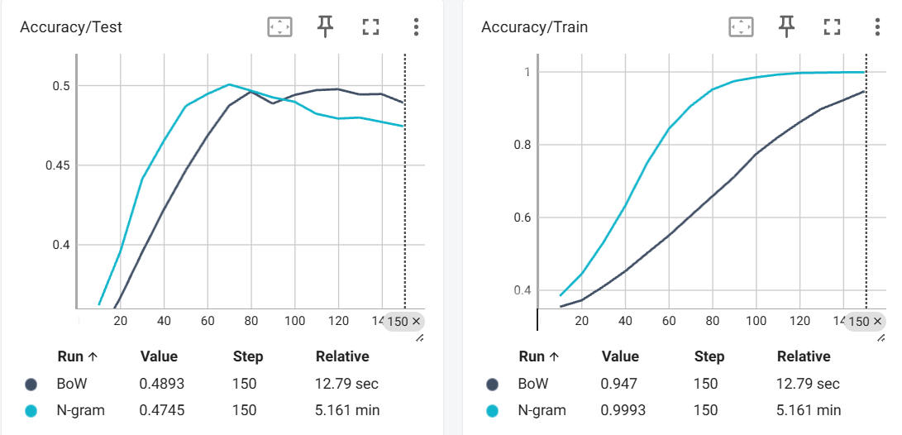


# TASK2

### 1.结果可视化

所有结果整体一览：


### 2.结果分析

#### （1）use_glove与no_glove：

1. 不使用glove时

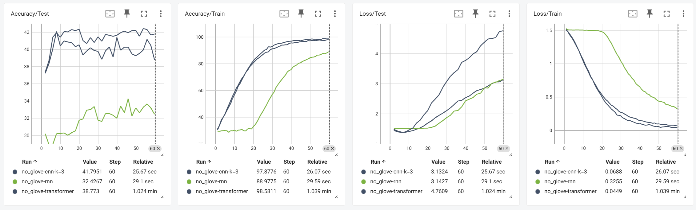

2. 使用glove时

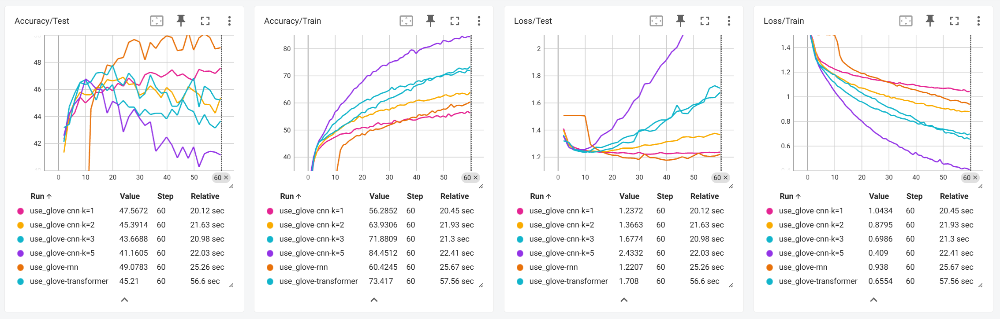

3. 分析：

可以看到：使用 GloVe 普遍提高了 CNN 的测试性能，尤其在这种数据规模不大的实验中，预训练 embedding 很重要。

#### （2）cnn的kernel_size多大比较合适：

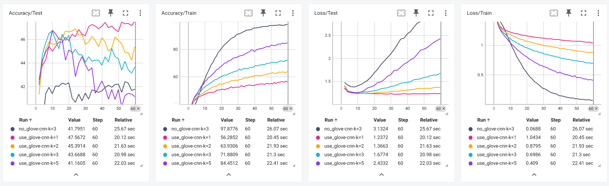

分析：在use_glove条件下

- kernel = 1    -> acc_test  = 47.6%
- kernel = 2    -> acc_test  = 45.4%
- kernel = 3    -> acc_test  = 43.7%
- kernel = 5    -> acc_test  = 41.1%

可以看到，kernel 越大效果越差。why:

- 情感分析中,很多情感词是单词级别, 例good，great，terrible，awful，kernel_size对应着n-gram size， k=1足矣
- 当 kernel 太大：组合反而增加噪声。

#### （3）CNN vs RNN vs Transformer

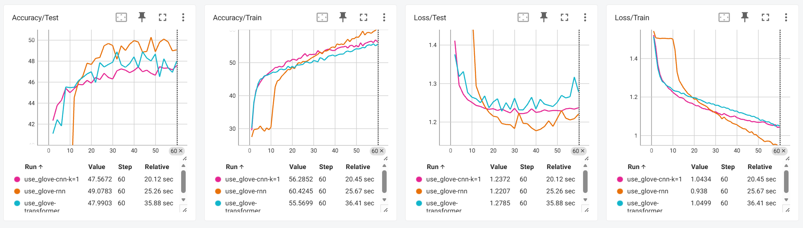

分析：在use_glove条件下

1. CNN: Test Accuracy = 43–47%, 学到一些特征, 但 capacity 不算很大。
   - pros: 训练稳定， 参数少，泛化好
   - cons: capacity 不算很大
2. RNN： Test Accuracy = 49%， 训练 accuracy 不高， 但 test accuracy 最好
   - pros: RNN 在建模序列信息上有优势。
   - cons: no_glove下表现非常差，要求提前对语意有一定了解，且随着句子变长，训练与推理变得更加复杂，且不稳定
3. Transformer:Train Accuracy=55.56%, Test Accuracy=47-49%
   - pros:训练快，对整句理解能力强，这个任务中，效果在CNN与RNN之间


# TASK3

## Sub1.加法任务

#### （1）损失函数


由上图可知：

- Decoder-only的模型对学习率比较敏感，lr=1e-4（橙色）, 4e-4（蓝色）时效果收敛都比较慢，lr=3e-4（红色）时收敛速度最快，震荡也加剧，效果并不好。
- Transformer模型在lr=1e-4时收敛收敛稳定（灰色）， lr=5e-4时震荡明显（黄色）。

#### （2）准确率

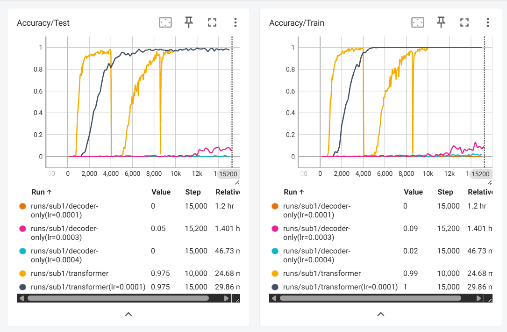

由上图可知：

- Transformer的效果非常好，不管是在测试集还是在训练集中，正确率都非常高，过拟合现象也不太明显。
- Decoder-only的效果比较一般，正确率非常低，也可能是我的参数没调好。
- **没有加 lr scheduler， 导致后期训练非常不稳定**，（下一个实验加了，效果就好很多）

#### （3）泛化性探索

使用ckpts/transformer_lr=0.0001_epoch_15000.pt权重。

考虑1+1， 2+2， 3+3， 4+4， 5+5,  6+6的情况（每个用了100份样本， 且换用和训练时不同的种子）

```python
1-digit accuracy: 0.0000
2-digit accuracy: 0.0404
3-digit accuracy: 1.0000
4-digit accuracy: 0.9899
5-digit accuracy: 0.8990
6-digit accuracy: 0.0000
```

可以看到模型在3,4,5位数的加法中表现比较不错，但是在1,2,6,中的正确率几乎为0。

因此可以推断出模型在3,4,5位数的加法中有不错的泛化性（训练集并未布满整个可能的状态空间），但是在这个状态空间以外的OOD部分，如1,2,6位数的加法，模型几乎看不出有泛化性。因此，**模型的泛化性是有限的**。


## Sub2. 训练自己的transformer

#### （1）参数选择

1. MiniGPT: embed_dim=256, num_heads=4, num_layers=4, block_size=96， 约为3M
2. training: epochs = 2, lr = 1e-4, warmup_ratio = 0.05，余弦shcedule
3. dataset: 选择wikitext-2数据集， 大小约为2M

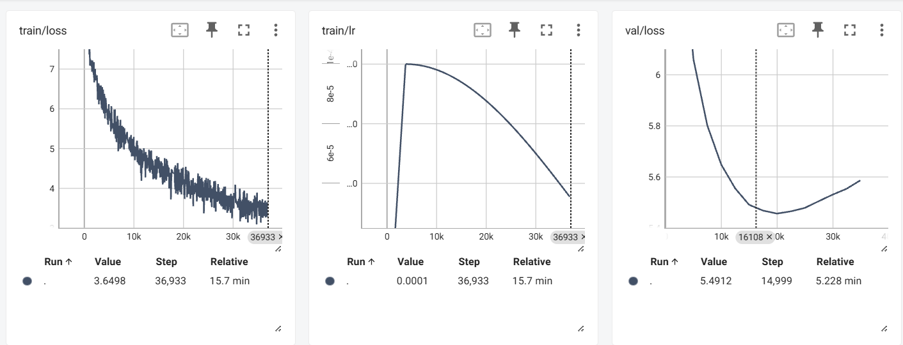

#### （2）结果演示

``````python
prompts = ["Valkyria Chronicles 3 is",
        "Albert Einstein is", 
        "The black hole is",
        "Japan is",
        "The Transformer is",
        "The Decoder-only model is",
        "The meaning of life is"]
# 前三个prompt在训练集里面， 后面三个不在
``````

输出：

>1. Valkyria Chronicles 3 is voiced by the National Football Association of the Year award , one of which were all of the decade and the most successful in the United Kingdom and the critically acclaimed edition of the series . The series ' ratings focus on the series ' first and ratings have been
>
>2. Albert Einstein is a collection of a recurring motif in the late 19th century . 
>
>3. The black hole is the sole owner that is the least of animals and several other factors , including the world 's main source of the " permanence " , " the end of the history of the poem , has a mild enlargement of the Ulysses in the
>
>4. Japan is not eligible to receive additional factors and is considered a general @-@ being @-@ paid application of all @-@ purpose of the country . This phase for the cinema was the first South Wales game to be released in 2003 , with two players
>
>5. The Transformer is listed as a " partialistic " typical portrait " , " the last question of steadfastness " , and the first single to be released as the fourth single from the album . The two remix is set in the UK by Def Jam Recordings . 
>
>6. The Decoder-only model is located on the west below the northern edge of the city . The level of the south wall is an east @-@ west of the Owego Creek watershed . 
>
>7. The meaning of life is the first person to indicate that they will be " one or the only a child " . 
>
>
>    = = = = = 
>
>    For example , The Huffington Post , Untold Story , premiered in New York , with the same title .

评价：

- 句子基本符合英文语法， 有主谓宾结构， 能生成类似 Wikipedia 风格句子。√
- 完全没有语义一致性， 例如“The black hole is the sole owner that is the least of animals…”， 出现了semantic collapse现象。 ×
- 经常出现高频短语拼接， 如“the first … of the … and the … of the …” ×
- 长文本崩塌（越往后越乱）， 第一句还“像人话”，后面直接崩  ×

反思：

- 预训练数据量太少， 选择的是wikitext2，大小仅为2M，对于从头开始预训练一个小型gpt依旧不太够
- 随机采样的数据中，重复内容较高，样本之间并不独立。


# EI-TASK-1

### 1.选择mujoco中的Pusher-v5环境

这里的任务并非把obj推到goal中，而是单纯的让ee贴到obj的位置。

**工作pipeline：**

- obj_pos - ee_pos 算出 pos_error， 规定夹爪向下为目标姿态， 算出rot_error

- 用比例控制， 计算出 `desired_velocity = np.concatenate([v_pos, v_rot])`

- 由 v = J(q) * q_dot 公式，用mujoco.mj_jacBody()算出雅可比矩阵

  ```python
  mujoco.mj_jacBody(
              model,
              data,
              jacp,    # 输出
              jacr,    # 输出
              ee_body_id
          )
  J = np.vstack((jacp, jacr))
  ```
  
- 用Damped Least Squares IK： J⁺ = Jᵀ (J Jᵀ + λ²I)⁻¹求逆

- 再将世界坐标系映射到关节的运动空间

### 2.最后效果演示

<video src="EI-task1/videos/rl-video-episode-0.mp4"></video>


# EI-TASK-4

### 1. 使用Starvla训练

VLM选用Qwen3-VL-4B-Instruct，Action head选用GR00T，训练集使用libero_mix data。使用4张4090进行训练，但是因为要训练170h左右，只是训练了一百多轮就没有继续了。

图中为训练的一些参数细节：因为总是会出现OOM，采用bf16精度，zero采用stage3。

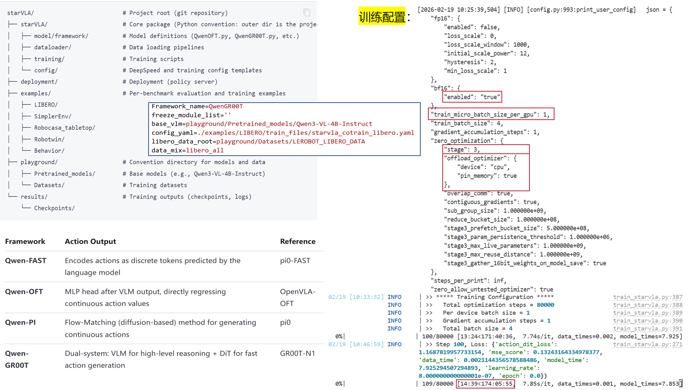

### 2.推理

在hf上下载训练好的权重进行测试。下载`Qwen2.5-VL-GR00T-LIBERO-4in1_checkpoints_steps_30000_pytorch_mode.pt`的权重，在libero_goal上进行推理。


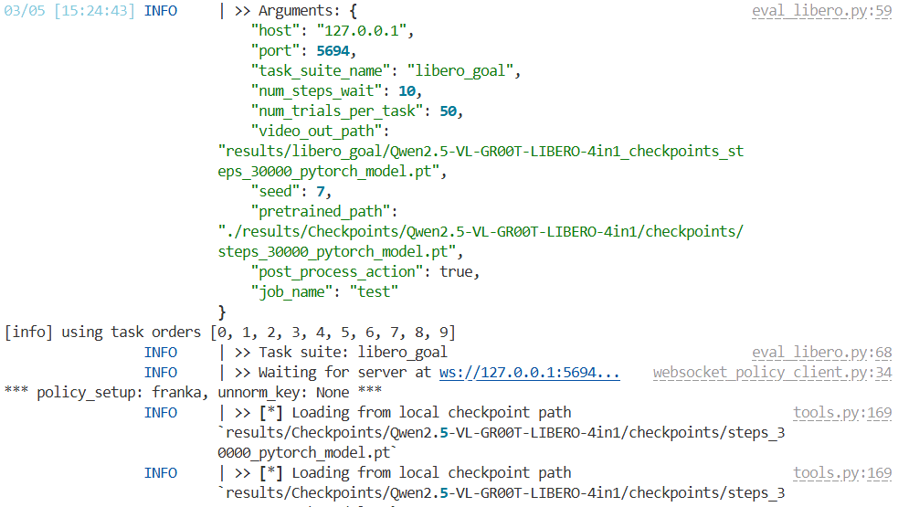


在走完500个episodes后， 得到最后的正确率为0.958

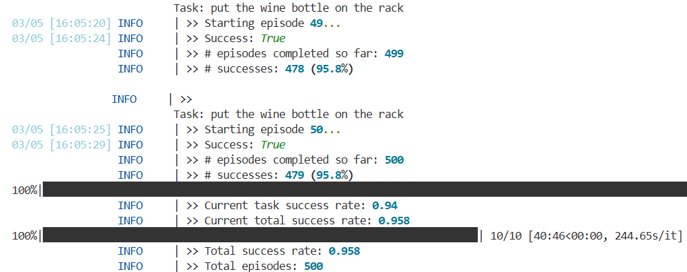